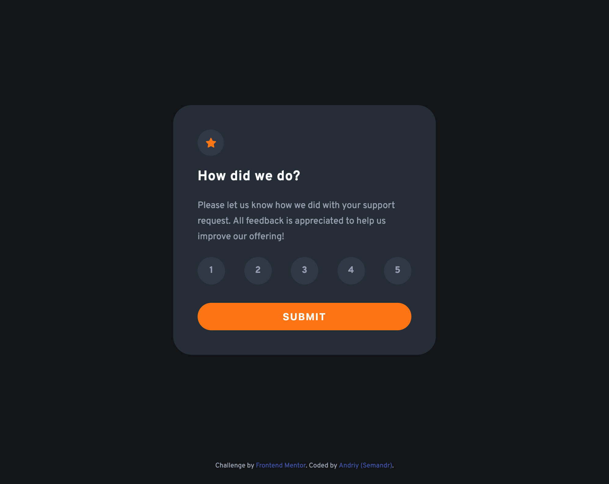

# Frontend Mentor - Interactive rating component solution

This is a solution to the [Interactive rating component challenge on Frontend Mentor](https://www.frontendmentor.io/challenges/interactive-rating-component-koxpeBUmI). Frontend Mentor challenges help you improve your coding skills by building realistic projects.

## Table of contents

- [Overview](#overview)
  - [The challenge](#the-challenge)
  - [Screenshot](#screenshot)
  - [Links](#links)
- [My process](#my-process)
  - [Built with](#built-with)
  - [What I learned](#what-i-learned)
  - [Continued development](#continued-development)
- [Author](#author)

## Overview

### The challenge

Users should be able to:

- View the optimal layout for the app depending on their device's screen size
- See hover states for all interactive elements on the page
- Select and submit a number rating
- See the "Thank you" card state after submitting a rating

### Screenshot

#

### Links

- Live Site URL: [Interactive rating component](https://semandr.github.io/interactive-rating-component/)

## My process

### Built with

- Semantic HTML5 markup
- CSS custom properties
- Flexbox
- CSS Grid
- SCSS
- Java Script ES6+
- Mobile-first workflow

### What I learned

How to use "Radio Buttons" through styling and getting values with Java Script

### Continued development

I would like to further study Java Script in practice, improving both future projects and my knowledge.

## Author

- Github - [Semandr](https://github.com/Semandr)
- Frontend Mentor - [Semandr (Andriy)](https://www.frontendmentor.io/profile/Semandr)
- Linkedin - [Andriy](https://www.linkedin.com/in/andriy-semenchenko-56bb28178/)
